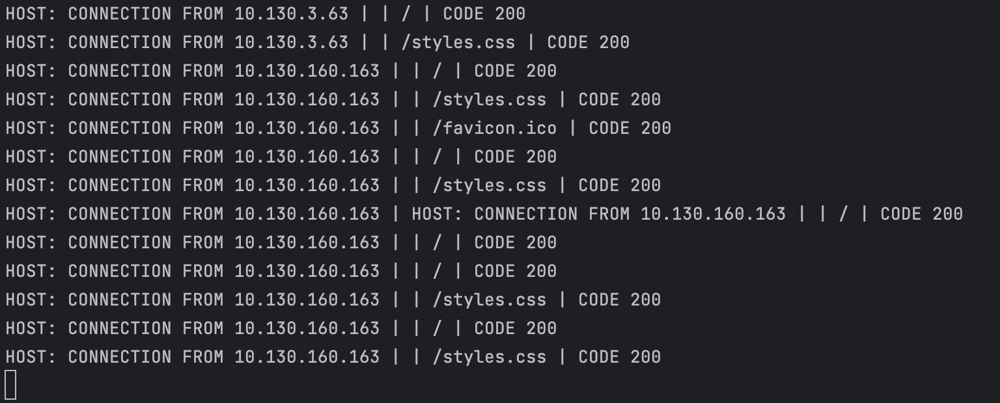

# SnorlaxServer - A Pure C/C++ HTTP Server
A project im working on learn about sockets and HTTP, and demonstrate some modern C/C++ programming ability.
# Usage
To run the server, first build it using cmake, it has no dependencies but will only work on -nix systems since we are using POSIX sockets implementation.

    ./SnorlaxServer [base_path]

The base path is the path the Server will host, all the files in that directory will be visible.

